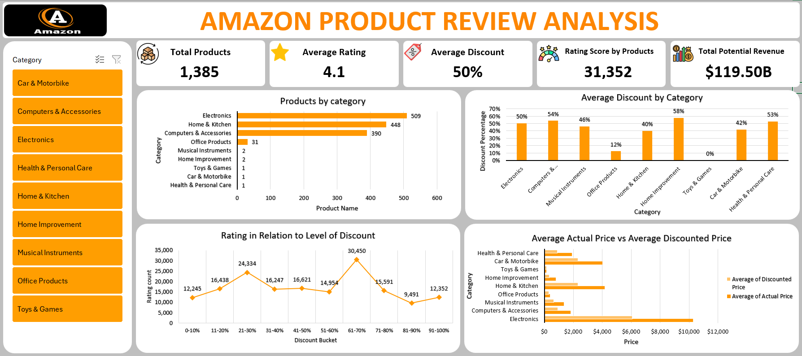

# My-Data-Analysis-Documentation
# 🛒 Amazon Product Review Analysis (Excel Dashboard)

A data-driven analysis of Amazon product listings using Excel, focusing on pricing, customer engagement, and performance metrics across multiple product categories. This project demonstrates strong skills in data cleaning, transformation, visualization, and business insight generation.

---

## 📊 Dashboard Preview

---

## 📁 Dataset

The dataset contains product listings scraped from Amazon, including:
- Product names
- Prices (actual & discounted)
- Ratings and number of reviews
- Categories

---

## 🎯 Objectives

- Understand product performance based on customer reviews and ratings
- Identify high-discount categories and products
- Evaluate pricing strategies using average and potential revenue
- Build a clean, dynamic Excel dashboard for decision-making

---

## 🔧 Tools & Skills Used

- **Microsoft Excel**
  - Pivot Tables
  - Power Query
  - IF, AVERAGE formulas
  - Custom number formatting (K/M/B)
- **Data Cleaning**
  - Removing inconsistencies
  - Standardizing product names
- **Dashboard Design**
  - KPI cards
  - Price range buckets
  - Interactive filters
- **Business Analysis**
  - Discount impact
  - Rating vs review volume
  - Potential revenue modeling

---

## 📌 Key Insights

- 💸 Products in the "Mobile Accessories" category receive the highest discounts on average.
- 🔝 The top-rated products tend to have both high customer satisfaction and high review counts.
- 📉 There is no direct correlation between higher discounts and better ratings — in fact, many highly rated products offer little to no discount.
- 🛍️ The bulk of listed products are priced between ₹200–₹500, making this a competitive pricing segment.

---

## 🧠 Sample Questions Answered

1. What is the average discount percentage by product category?
    -  Rows: Category
    -  Values: Discount % → summarize by Average 
2. How many products are listed under each category?
    - Rows: Category
    - Values: Product Name → Count
3. What is the total number of reviews per category?
    - Rows: Category
    - Values: Rating Count → Sum
4. Which products have the highest average ratings?
    - Rows: Category
    - Values: Rating Count → Average (Sort dataset by the Average Rating count column) (descending)
5. What is the average actual price vs the discounted price by category?
    - Rows: Category
    - Values: Actual Price → Average,
              Discounted Price → Average
6. Which products have the highest number of reviews?
    - Rows: Category
    - Values: Rating Count → Sum (Sort dataset by the Sum of Rating count column) (descending)
7. How many products have a discount of 50% or more?
    - Rows: Discount Group
    - Values: Category → Count
8. What is the distribution of product ratings (e.g., how many products are rated 3.0, 4.0, etc.)?
    - Rows: Rating
    - Values: Product Name → Count
9. What is the total potential revenue (actual_price × rating_count) by category?
    - Total potential revenue by category (Actual Price × Rating Count)
    - Add calculated column: =Actual Price * Rating Count
    - Rows: Category
    - Values: Discount % → summarize by Average
10. What is the number of unique products per price range bucket (e.g., <₹200, ₹200–₹500, >₹500)?
    - Number of unique products per price range bucket
    - Create new column Unique Products Price Bucket: =IF(D2<200, "<200", IF(D2<=500, "200 – 500", ">500"))
    - Rows: Unique Products Price Bucket
    - Values: Unique Products Price Bucket → Count
11. How does the rating relate to the level of discount?
    - Create a new column Discount buckets like: 0–10%, 11–20%, ..., 91–100%
    - Excel Formular=IF([@Discount%]<=10, "0-10%", IF([@Discount%]<=20, "11-20%", IF([@Discount%]<=30, "21-30%", ...)))
    - Rows: Discount Bucket
    - Values: Rating Count → summarize as Average
12. How many products have fewer than 1,000 reviews?
    - Create a new Review Group
    - Excel Formular==IF([@[Rating Count]]<=1000, "Yes", "No")
    - Rows: Review Group
    - Values: Product Name → Count
13. Which categories have products with the highest discounts?
    - Rows: Category
    - Values: Discounted Price → Max
14. Identify the top 5 products in terms of rating and number of reviews combined
    - Create calculated column: = ([@Rating]+([@[Rating Count]]/1000) (Choose a factor like 1000 to balance weight)
    - Rows: Product ID
    - Values: Rating Score → Sum
   
---

## 📂 Files Included

- [Amazon Product Review Analysis.xlsx](Amazon%20Product%20Review%20Analysis.xlsx)
- [Dashboard_screenshot.png](dashboard_screenshot.png)

